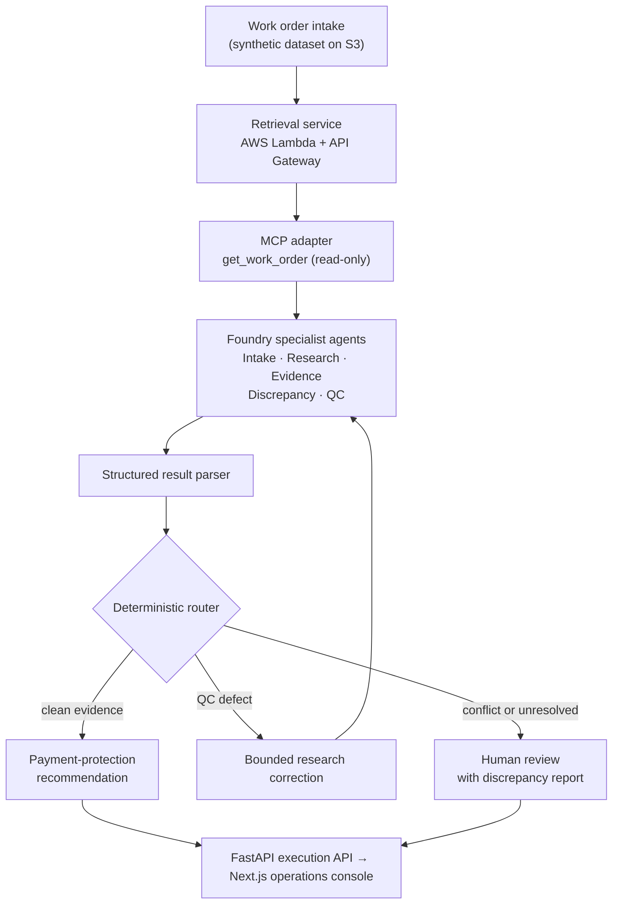

<h1 align="center">Construction Legal AI Suite</h1>

<p align="center">
  <b>Evidence-grounded AI for construction payment protection:</b> multi-agent work-order intelligence, Notice to Owner research coaching and payment-risk prediction, built so that AI informs decisions and people stay accountable for them.
</p>

<p align="center">
  <a href="https://github.com/gopalgk53/construction-legal-ai-suite/actions/workflows/payment-risk-ci.yml"></a>
  <a href="https://github.com/gopalgk53/construction-legal-ai-suite/actions/workflows/deploy-wo-intelligence-api.yml"></a>
  <a href="https://github.com/gopalgk53/construction-legal-ai-suite/actions/workflows/deploy-wo-intelligence-web.yml"></a>
  <a href="LICENSE"></a>
  <br>
  
  
  
  
  
  
  
  
</p>

> **Data boundary:** every dataset in this repository is **synthetic**. Nothing here contains SunRay, customer, project or property data. The outputs support operational prioritisation and human review. They are not legal advice and do not make legal determinations.

---

## Why this exists

In the US, subcontractors and suppliers protect their right to be paid through strict, deadline-driven steps: preliminary notices such as the **Notice to Owner**, correct identification of the owner, general contractor and lender, and mechanic's lien or bond claims when payment stalls. Missing a party or a deadline can forfeit those rights.

The research behind each notice is detailed and error-prone. Customer-provided details often conflict with public records, contracts or other documents, and the cost of a confident wrong answer is high. This suite applies AI to that workflow with three rules:

1. **Evidence first.** Every finding points to its source. What the customer said is kept separate from what was verified.
2. **AI suggests, code decides.** Agents return structured findings. Deterministic Python code controls every workflow transition.
3. **Escalate uncertainty.** Conflicting evidence goes to a person with the discrepancy explained. The system does not guess.

## Projects

| Project | What it does | Status |
|---|---|---|
| [**wo-agent-orchestrator**](wo-agent-orchestrator/) | **Autonomous Work Order Intelligence.** Specialist Foundry agents for intake, research, evidence, discrepancy detection and QC, with a bounded research-correction loop and human-review escalation | Deployed on Azure Container Apps |
| [**nto-operations-copilot**](nto-operations-copilot/) | **NTO Operations Copilot.** A research coach that guides new Notice to Owner researchers step by step, retrieves work-order evidence and recommends the next approved action | [Live on Azure App Service](https://nto-copilot-web-gopalg53.azurewebsites.net) |
| [**payment-delay-predictor**](payment-delay-predictor/) | **Construction Payment Risk Prediction.** Interpretable ML that flags work likely to hit payment delays, with temporal validation and a DataRobot AutoML challenger study | CI on GitHub Actions; AWS serving design |
| [**ai-portfolio-commander**](ai-portfolio-commander/) | Supporting FastAPI + PostgreSQL service for tracking projects, milestones, tasks and learning sessions | Local |

## Architecture highlights

- **Multi-agent orchestration on Microsoft Foundry.** Each agent has one job (intake, research, evidence, discrepancy, QC or research correction) and returns a structured result, never free text that drives the workflow.
- **Tools through the Model Context Protocol.** Agents retrieve work orders through a read-only `get_work_order` MCP adapter running on AWS Lambda behind API Gateway. They can read evidence but cannot change it.
- **Deterministic control plane.** A Python parser validates each agent result, then a router picks the next step from explicit rules. Model output never directly moves a work order between states.
- **Bounded correction.** When QC finds a research defect, the system runs a research correction, applies it as a separate overlay and sends the case back to QC. Source records stay unchanged. Retries are capped by a configured limit, and once it is exceeded the case escalates to human review, so there is no endless autonomous loop.
- **Evidence model.** Findings are classed as documentary evidence, supporting evidence, direct confirmation or customer authorisation, and discrepancies are tracked both between customer claims and documents, and between documents.
- **Cross-cloud delivery.** Data and retrieval run on AWS, the agents on Microsoft Foundry, and the API and console on Azure. Deployment runs through GitHub Actions with OIDC, so no long-lived cloud secrets are stored.



## Key features

**Payment-rights protection**
- Notice to Owner research guidance for new researchers, one step at a time
- Explicit handling of customer-provided data versus independently resolved information
- A review queue for complex cases rather than silent automation

**Document and evidence intelligence**
- Evidence classification with provenance for every finding
- Discrepancy detection between customer claims and documents, and between documents, for example conflicting general contractor or owner names
- Immutable source records; corrections are applied as a separate overlay

**Risk and compliance support**
- Payment-delay risk scores with a review threshold frozen before final testing (0.20)
- Temporal (out-of-time) validation to avoid leakage from future workflow patterns
- Model governance: an interpretable production model, a documented challenger study, and monitoring and incident runbooks

## Quick start

Each project runs on its own. Clone once, then follow the project you want.

```bash
git clone https://github.com/gopalgk53/construction-legal-ai-suite.git
cd construction-legal-ai-suite
```

### NTO Operations Copilot

Requires Python 3.12, Node.js 22+, and the Azure CLI signed in to an account with access to a Foundry project.

```bash
cd nto-operations-copilot/backend
cp .env.example .env    # set AZURE_AI_PROJECT_ENDPOINT, AZURE_AI_AGENT_NAME, AZURE_AI_AGENT_VERSION, FRONTEND_ORIGINS
python3.12 -m venv .venv && source .venv/bin/activate
pip install -r requirements.txt
uvicorn app:app --reload --host 127.0.0.1 --port 8000
```

In a second terminal:

```bash
cd nto-operations-copilot/frontend
cp .env.example .env.local
npm ci
npm run dev             # http://localhost:3000
```

### Work Order Intelligence (multi-agent API)

```bash
cd wo-agent-orchestrator
python3.12 -m venv .venv && source .venv/bin/activate
pip install -r requirements.txt
uvicorn api.main:app --reload --port 8000
python -m pytest tests/ -q      # 75 tests
```

Or with Docker:

```bash
docker build -t wo-intelligence-api wo-agent-orchestrator
docker run -p 8000:8000 -e PORT=8000 wo-intelligence-api
```

The agents need a Microsoft Foundry project and the MCP retrieval endpoint. See [`wo-agent-orchestrator/docs/RUNBOOK.md`](wo-agent-orchestrator/docs/RUNBOOK.md) for the full environment setup.

### Payment Risk Prediction

```bash
cd payment-delay-predictor
pip install -r requirements-api.txt -r requirements-test.txt
python -m pytest tests
docker build -t payment-risk-api .
docker run -p 8000:8000 payment-risk-api
```

## Performance and evaluation

All results below come from the **synthetic** evaluation sets in this repository.

**Work-order intake agent** (dataset v2.1: 120 work orders, 24 scenario families, seed 42)

| Metric | Result |
|---|---:|
| Overall | 154 / 156 (≈99%) |
| Tool selection | 100% |
| Tool-call success | 100% |
| Tool-call accuracy | 100% |
| Tool-output utilisation | 83% |
| Latency P50 / P95 | 15.1 s / 18.8 s |

Mislabelled scenarios found in an earlier dataset version were corrected in v2.1. The earlier version stays frozen, so results remain reproducible.

**Payment-risk prediction** (ordered train, validation and out-of-time test periods)

| Model | Holdout ROC-AUC | Notes |
|---|---:|---|
| Logistic Regression v1 | — | Production model: inspectable, integrated with the feature contract and serving path |
| Elastic-Net α=0.5 (DataRobot) | 0.684 | Best challenger; backtest ROC-AUC 0.673, holdout PR-AUC 0.414 |
| LightGBM (DataRobot) | 0.681 | |
| XGBoost (DataRobot) | 0.677 | |

The challengers' small lead did not justify replacing a transparent production model. Each project's README explains that decision in full.

**Engineering quality**
- 75 automated tests on the multi-agent control plane (router, parser, correction overlay, observability, API)
- CI on every change to the payment-risk project, plus OIDC deployments for the work-order API and web console

## Repository structure

```text
construction-legal-ai-suite/
├── wo-agent-orchestrator/    # Multi-agent work-order intelligence (FastAPI + Next.js)
├── nto-operations-copilot/   # NTO research coach (FastAPI + Next.js)
├── payment-delay-predictor/  # Payment-risk ML: API, dashboard, experiments
├── ai-portfolio-commander/   # FastAPI + PostgreSQL project tracker
└── .github/workflows/        # CI and Azure deployments
```

## Author

**Maddipalli Gopalakrishna**, AI/ML Engineer
[Portfolio](https://www.gopalakrishnagenai.in) · [LinkedIn](https://www.linkedin.com/in/maddipalli-gopalakrishna-b3598718b/) · [GitHub](https://github.com/gopalgk53)

Released under the [MIT License](LICENSE).
