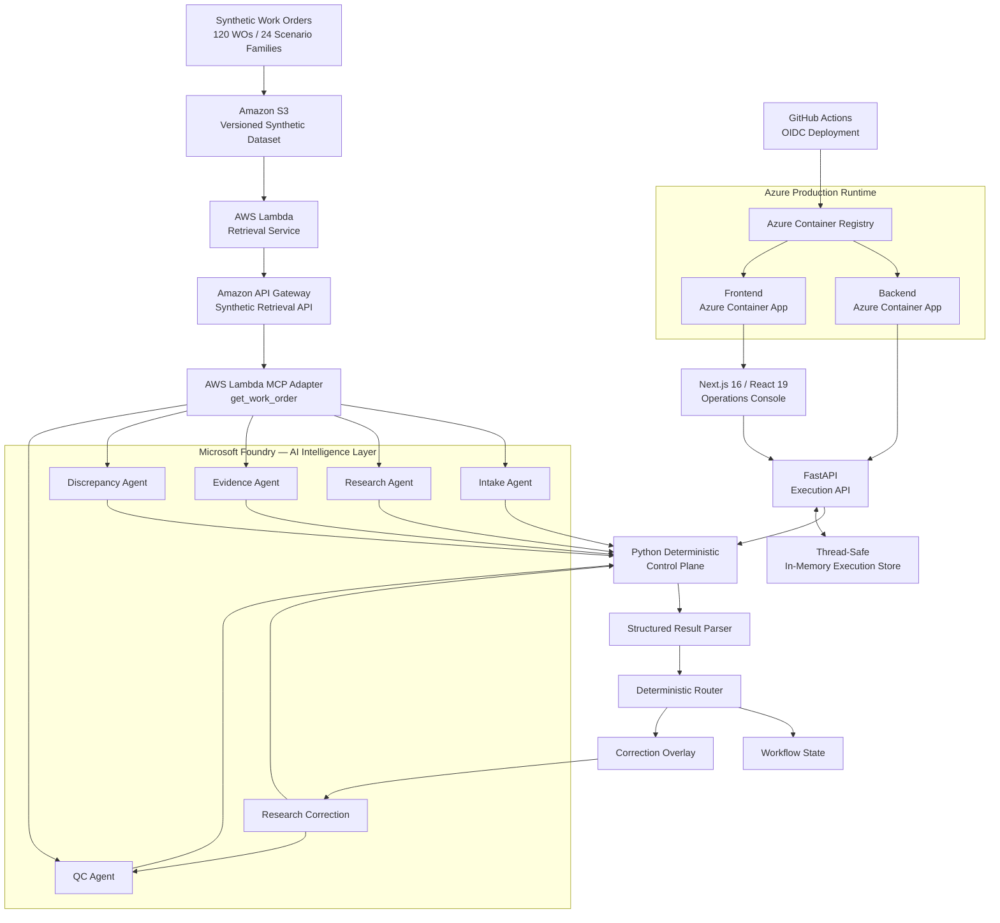
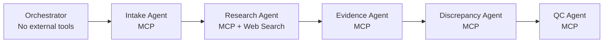
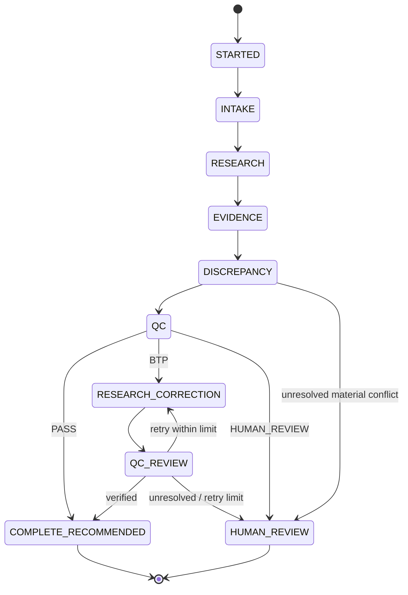
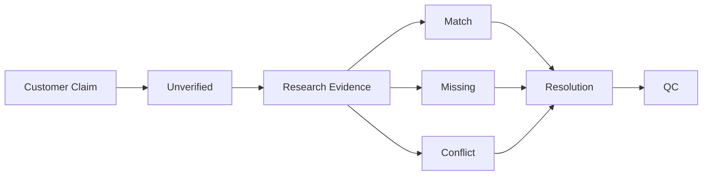
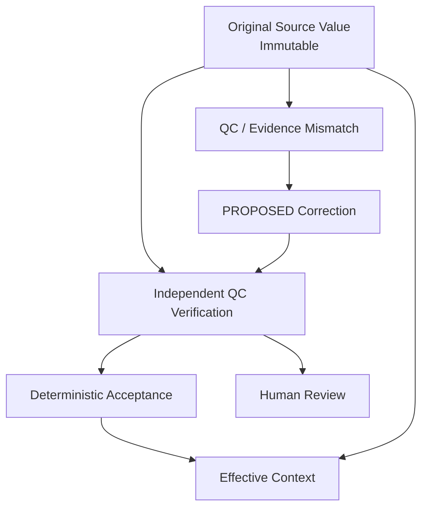
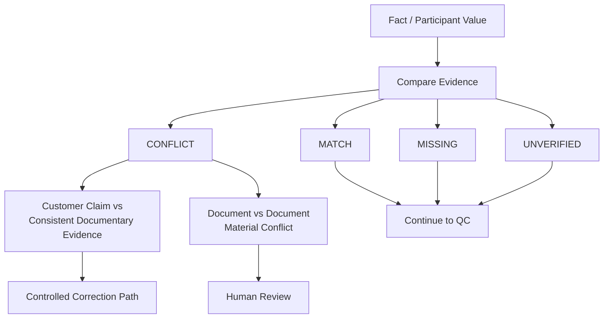
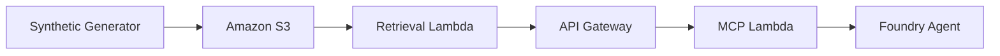
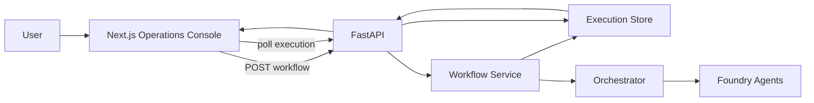
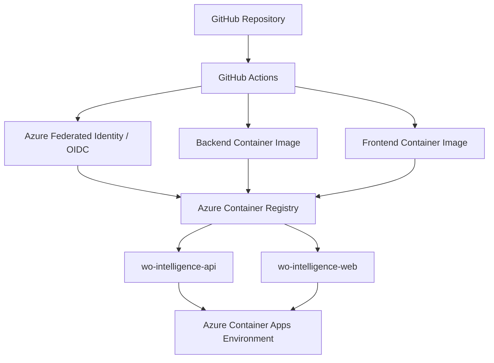
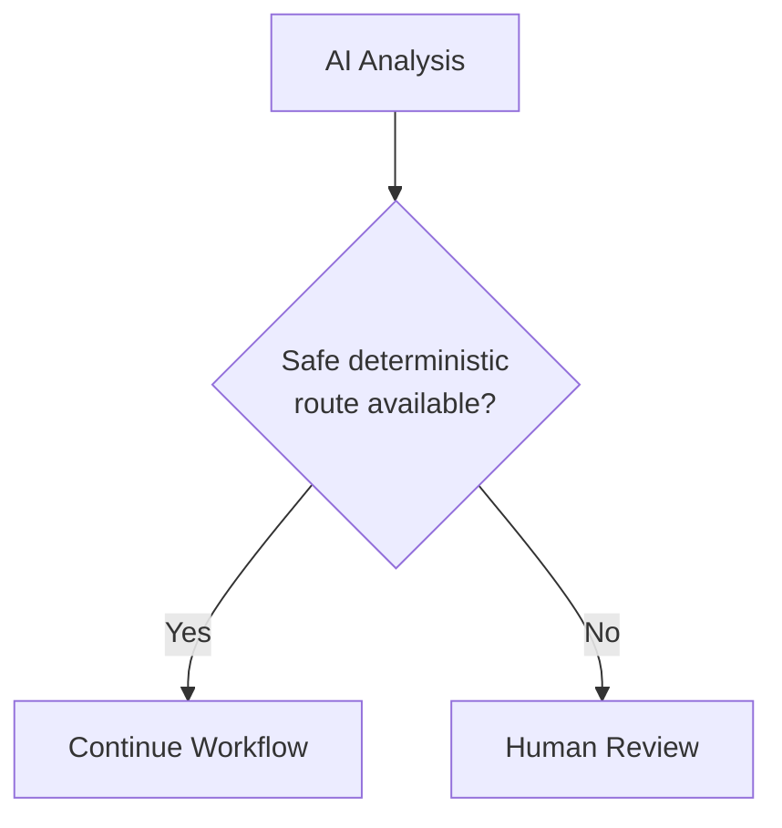

# System Architecture

## Autonomous Work Order Intelligence & Operations Platform

This document describes the production architecture, control boundaries, agent responsibilities, evidence model, safety mechanisms, cloud topology, and execution lifecycle of the Autonomous Work Order Intelligence & Operations Platform.

---

## 1. Architecture Objective

The platform is designed around one fundamental separation:

```text
Probabilistic AI
      │
      ▼
Structured Results
      │
      ▼
Deterministic Control
      │
      ▼
Operational Recommendation
```

AI agents provide intelligence.

Application code retains authority over workflow transitions.

This prevents probabilistic model output from directly controlling consequential operational states.

---

## 2. End-to-End Architecture



---

## 3. Responsibility Boundaries

### AI Layer

Responsible for:

- extraction
- research
- evidence interpretation
- discrepancy reasoning
- explanations
- correction proposals
- QC recommendations

The AI layer does not own final workflow transitions.

### Deterministic Application Layer

Responsible for:

- structured-output validation
- state transitions
- correction attempt limits
- correction-overlay acceptance
- human-review routing
- terminal recommendations
- MCP approval policy

### Human Layer

Responsible for unresolved or exceptional situations that the system cannot safely resolve.

Examples include unresolved material documentary conflicts.

---

## 4. Agent Topology



The orchestrator intentionally has no external tools.

Specialist agents receive only the tools required for their responsibility.

---

## 5. Workflow State Machine



The state machine is controlled by Python rather than model-generated transitions.

---

## 6. Evidence Provenance Architecture



A customer claim remains a customer claim unless independently supported.

`UNVERIFIED` is not equivalent to `INCORRECT`.

---

## 7. Correction Architecture

Source values are immutable.



The correction overlay does not rewrite the original evidence.

Instead, an effective view can combine immutable source information with accepted corrections.

---

## 8. Correction Safety

The deterministic layer enforces:

```text
Original data
    ↓
Evidence-supported proposal
    ↓
PROPOSED correction
    ↓
Independent QC
    ↓
Python validation
    ↓
Accepted overlay
```

Correction cycles are bounded.

The system escalates instead of entering an unlimited autonomous correction loop.

---

## 9. Discrepancy Decision Model



Missing and unverified information do not automatically trigger escalation.

Materiality and established workflow requirements matter.

---

## 10. MCP Tool Boundary

Current automatically approved tool:

```text
sunray-wo-mcp
└── get_work_order
```

Characteristics:

- read-only
- synthetic-data only
- explicitly allowlisted

The approval rule is intentionally narrow.

Future tools capable of mutation or consequential actions must receive separate approval policies.

---

## 11. AWS Retrieval Architecture



The retrieval layer exposes synthetic work-order information to the agent system.

The architecture intentionally keeps source data retrieval separate from AI reasoning.

---

## 12. Application Architecture



Workflow execution is asynchronous from the frontend perspective.

The frontend starts an execution and polls for status.

---

## 13. API Boundary

Supported application endpoints:

```text
GET  /health

GET  /api/v1/demo-scenarios

POST /api/v1/workflows/{wo_id}/run

GET  /api/v1/executions/{execution_id}
```

Synthetic work-order identifiers are validated against:

```regex
^SYN-WO-\d{6}$
```

---

## 14. Execution Store

The current execution store is:

- in-memory
- thread-safe
- intentionally limited to the portfolio demonstration

Because state is local to a container:

```text
Container restart
      ↓
Execution state lost
```

and:

```text
Replica A state ≠ Replica B state
```

Therefore the backend currently operates with one replica.

A production evolution should introduce durable shared state.

Possible future implementations include:

```text
PostgreSQL
Redis
Cosmos DB
Durable workflow/state service
```

The exact choice should depend on production requirements.

---

## 15. Azure Deployment Architecture



No long-lived Azure deployment secret is required by the GitHub deployment workflow.

---

## 16. Cross-Cloud Boundary

```text
AWS
│
├── Synthetic dataset
├── S3
├── Retrieval Lambda
├── API Gateway
└── MCP adapter
        │
        ▼
Microsoft Foundry
│
├── Model execution
├── Specialist agents
├── MCP access
└── Research tooling
        │
        ▼
Deterministic Python Application
        │
        ▼
Azure
│
├── Container Registry
├── Backend Container App
└── Frontend Container App
```

This architecture demonstrates cross-cloud integration without requiring every system component to run on the same provider.

---

## 17. CI/CD Boundary

The deployment flow is:

```text
Code change
    ↓
Git commit
    ↓
GitHub
    ↓
GitHub Actions
    ↓
OIDC authentication
    ↓
Container build
    ↓
Azure Container Registry
    ↓
Azure Container Apps revision
    ↓
Production traffic
```

Frontend and backend deployment workflows remain independently deployable.

---

## 18. Privacy Boundary

The implementation is synthetic-only.

```text
Real Operational Data
        │
        X
        │
        ▼
Portfolio System
```

The portfolio system must not contain:

- real customer names
- real work-order IDs
- real addresses
- real project documents
- real attachments
- proprietary datasets
- confidential customer information

Synthetic scenarios model workflow behavior without reproducing production information.

---

## 19. Observability Boundary

The observability design favors structured operational metadata.

```text
Workflow
   ↓
Stage / status metadata
   ↓
Structured telemetry
```

It intentionally avoids logging full work-order payloads or raw agent messages.

This reduces unnecessary information exposure.

---

## 20. Human-in-the-Loop Boundary

Human review is a designed system state rather than an AI failure.



Examples that can require human review include unresolved material documentary conflicts or repeated failed correction attempts.

---

## 21. Golden Paths

### Clean

```text
SYN-WO-000001

Intake
→ Research
→ Evidence
→ Discrepancy
→ QC
→ Complete Recommended
```

### Controlled Correction

```text
SYN-WO-000116

Intake
→ Research
→ Evidence
→ Discrepancy
→ BTP
→ Research Correction
→ QC Re-review
→ Complete Recommended
```

### Safety Escalation

```text
SYN-WO-000111

Intake
→ Research
→ Evidence
→ Discrepancy
→ QC
→ Human Review
```

Together these demonstrate:

```text
Autonomy
+
Correction
+
Escalation
```

rather than demonstrating only successful AI execution.

---

## 22. Production Evolution

A larger production implementation would require additional controls before processing non-public operational data.

Examples include:

- durable execution persistence
- stronger API authentication
- private networking
- secret rotation
- centralized authorization
- durable audit history
- expanded telemetry
- distributed tracing
- production alerting
- model/version governance
- prompt/version governance
- dataset governance
- organization-specific compliance review
- legal review of consequential workflows
- load testing
- disaster recovery
- multi-replica execution coordination

These are deliberately identified as future production requirements rather than represented as already implemented.

---

## 23. Architectural Outcome

The final architecture demonstrates a controlled autonomous AI pattern:

```text
Evidence
   ↓
Specialist AI
   ↓
Structured Results
   ↓
Deterministic Validation
   ↓
QC / Correction / Escalation
   ↓
Operational Recommendation
```

The most important property of the system is not the number of agents.

It is the explicit separation between **probabilistic reasoning and deterministic authority**.